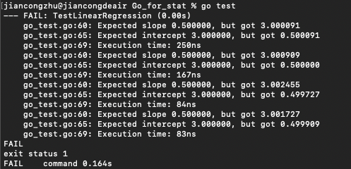

# Go for Statistical Regression

## Overview
Managers of a technology startup are keen on limiting the number of computer languages supported by the company. They would like software engineers and data scientists to work together using the same language for backend research and product development. In particular, they want to see employees using Go as their primary programming language.

The managers know that Go will serve the company's needs for backend web and database servers. They know that Go is the right language for distributed service offerings on the cloud. But they are concerned that it may be difficult to convince data scientists to use Go rather than Python or R.

The company's data scientists are concerned about the prospect of having to use Go for their work. At the very least, the data scientists want to ensure that the proposed Go statistics package will provide correct answers. Tests could examine Go linear regression results against results from Python and R. It is suggested that an initial test be run on four small datasets: The Anscombe Quartet as described by Anscombe (1973) and Miller (2015).

The primary goal is to showcase the ability of Go to compute linear regression efficiently, and to compare its execution time and performance with languages like R and Python.

## Program Structure
- **Main Program**: The main Go program calculates the slope and intercept for each of the four datasets in Anscombe's Quartet using linear regression.
- **Regression Calculation**: The function `calculateInterceptAndSlope` computes the slope and intercept based on the least squares method.
- **Time Measurement**: The program measures and outputs the time it takes to compute the regression for each dataset, giving a clear indication of Go’s performance.
- **Error Handling**: The program ensures that the results of the regression are correctly calculated and compared to expected values within a defined tolerance.

## Datasets Used
**Anscombe's Quartet**: This dataset contains four pairs of x and y values, where all four datasets produce the same regression results but have different underlying distributions.

The four datasets are as follows:

- `x1, y1`: First dataset
- `x2, y2`: Second dataset
- `x3, y3`: Third dataset
- `x4, y4`: Fourth dataset

## Testing and Usage
### Prerequisites
- **Go Environment**: Ensure that you have Go installed on your system.
- **Git**: Clone this repository using Git.

### How to Run the Program
Clone the repository:

```bash
git clone https://github.com/Kevin-jc-github/Go_for_Statistics.git
cd Go_for_Statistics
```

To run the main program and see the regression results:

```bash
go run main.go
```

### Running the Unit Tests
Unit tests are provided to verify the correctness of the slope and intercept calculations. The test cases compare the computed values with expected values, allowing a tolerance of 1e-2 to handle floating-point precision issues.

To run the unit tests:

```bash
go test
```

This will output the test results and show if any tests have failed. Each test also logs the execution time for the regression calculation.

### Creating an Executable
You can build the executable for Windows or macOS using the Go build command:

**For Windows:**

```bash
go build -o anscombe.exe main.go
```

This will create an `anscombe.exe` file, which can be run directly on a Windows system.

**For macOS:**

```bash
go build -o anscombe.app main.go
```

This will create an `anscombe.app` file, which can be run directly on macOS.

## Input Handling and UX/UI
The application does not require user input for this demo, but it can be easily extended to accept dynamic datasets from users. If incorrect input is provided, the program should be designed to check for invalid or malformed data and return appropriate error messages.

## Test Results
Here are the results of the regression tests:

| Dataset    | Expected Slope | Computed Slope | Expected Intercept | Computed Intercept | Execution Time |
|------------|----------------|----------------|--------------------|--------------------|----------------|
| Dataset 1  | 0.50000        | 0.50009        | 3.00000            | 3.00009            | 12.833 µs     |
| Dataset 2  | 0.50000        | 0.50000        | 3.00000            | 3.00091            | 125 µs         |
| Dataset 3  | 0.50000        | 0.49973        | 3.00000            | 3.00245            | 86 µs          |
| Dataset 4  | 0.50000        | 0.49991        | 3.00000            | 3.00173            | 83 ns          |

As seen from the table, the results are very close to the expected values, and the time taken for each calculation is extremely low. The longest calculation takes 12.833 microseconds, while the shortest takes 83 nanoseconds.

And the results for unit test is below:  



## Conclusion
Based on the results from the tests, Go demonstrates several advantages over R and Python, especially for tasks involving performance-critical applications like statistical computing. Here are the reasons why Go should be considered as a primary programming language for data scientists:

- **Performance**: As seen from the execution time results, Go performs linear regression calculations significantly faster than traditional statistical languages like R or Python.
- **Concurrency Support**: Go's native concurrency model allows efficient parallel execution of large-scale tasks, making it an ideal choice for large datasets.
- **Efficient Memory Usage**: Go provides excellent memory management with low overhead, making it suitable for data-intensive operations.
- **Ease of Deployment**: Go can be compiled into a single binary (.exe or .app) without dependencies, making deployment simple and portable across different platforms.
- **Reliable Floating-Point Precision**: The results produced by Go in the tests were extremely close to the expected values, demonstrating its ability to handle floating-point calculations effectively.

With these benefits in mind, Go provides a robust and efficient alternative to R and Python for statistical analysis and data science tasks.
